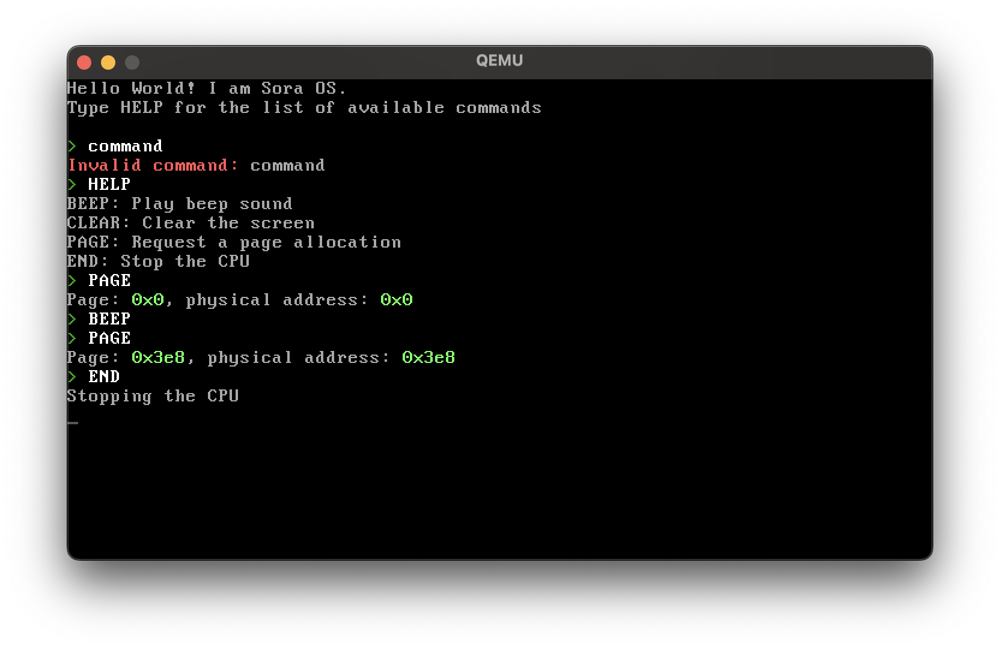

# Sora: A mini hobby operating system

Sora is a small operating system with a small bootloader and a small kernel.

This project was started in January 2024. At the time, I had finished an operating system class a few semesters ago but it was a lot of theory. After that class, I didn't feel like I truely understand operating system and how they work. So I decided to try to make my own operating system to get more practical experience and a deeper understanding of OS development. That's why I started this project.

This is a big learning project for me so the code is somewhat messy. I've documented everything quite throughly so if you want to, you can go through the code and learn more about operating system development.



# Requirements

Before you can compile this, you need to install some tools and libraries first:

- [NASM](https://www.nasm.us/)
- [QEMU](https://www.qemu.org/)
- [i386-elf-toolchain](https://github.com/nativeos/i386-elf-toolchain/releases)
- [binutils](https://www.gnu.org/software/binutils/)
- [gmp](https://gmplib.org/)
- [mpfr](https://www.mpfr.org/)

You need to change the i386 compiler and i386 debugger paths in [Makefile](Makefile) to the path of your i386 compiler and debugger on your system:
```
CC = PATH_TO_i386_COMPILER # change this to path to your i386 compiler
GDB = PATH_TO_i386_DEBUGGER # change this to path to your i386 gdb
```

# Project structure

```
sora
├─ boot
│  ├─ bootsector.asm
│  ├─ disk.asm
│  ├─ enter32.asm
│  ├─ gdt.asm
│  ├─ kernel-entry.asm
│  ├─ print-hex.asm
│  ├─ print.asm
│  └─ print32.asm
├─ cpu
│  ├─ hlt.c
│  ├─ hlt.h
│  ├─ idt.c
│  ├─ idt.h
│  ├─ int.asm
│  ├─ isr.c
│  ├─ isr.h
│  ├─ ports.c
│  ├─ ports.h
│  ├─ timer.c
│  ├─ timer.h
│  └─ type.h
├─ drivers
│  ├─ keyboard.c
│  ├─ keyboard.h
│  ├─ screen.c
│  ├─ screen.h
│  ├─ speaker.c
│  └─ speaker.h
├─ kernel
│  ├─ kernel.c
│  └─ kernel.h
├─ libc
│  ├─ boolean.h
│  ├─ function.h
│  ├─ mem.c
│  ├─ mem.h
│  ├─ string.c
│  └─ string.h
```

| Directory | Description |
| --- | --- |
| [boot](boot) | Bootsector code |
| [cpu](cpu) | CPU dependent code like IDT, ISR, etc |
| [drivers](drivers) | Hardware drivers |
| [kernel](kernel) | Main kernel code |
| [libc](libc) | Custom standard library |

# Useful commands

| Commands | Description |
| --- | --- |
| `make` | Compile |
| `make run` | Compile and run|
| `make debug` | Run and debug in GDB |
| `make clean` | Remove object and binary files |

# Milestones

- [x] Simple bootloader in 16-bit real mode
- [x] Accessing the disk
- [x] Program the GDT
- [x] Switch to 32-bit protected mode
- [x] Simple kernel
- [x] Video driver
- [x] Interrupt Descriptor Table
- [x] Parse user input
- [x] Memory allocator
- [x] Frame allocation

# Documentation

You can find all the documentations in this [directory](docs). I've also added detailed explanation comments for most of the code so you can understand the code by reading it.

# References

- [OSDev Wiki](https://wiki.osdev.org/Main_Page) (Main resource)
- [University of Birmingham's os-dev.pdf](https://www.cs.bham.ac.uk/~exr/lectures/opsys/10_11/lectures/os-dev.pdf)
- [The little book about OS development](https://littleosbook.github.io/)
- [Intel 64 and IA-32 Architectures Software Developer’s Manual](https://www.intel.com/content/www/us/en/developer/articles/technical/intel-sdm.html)

