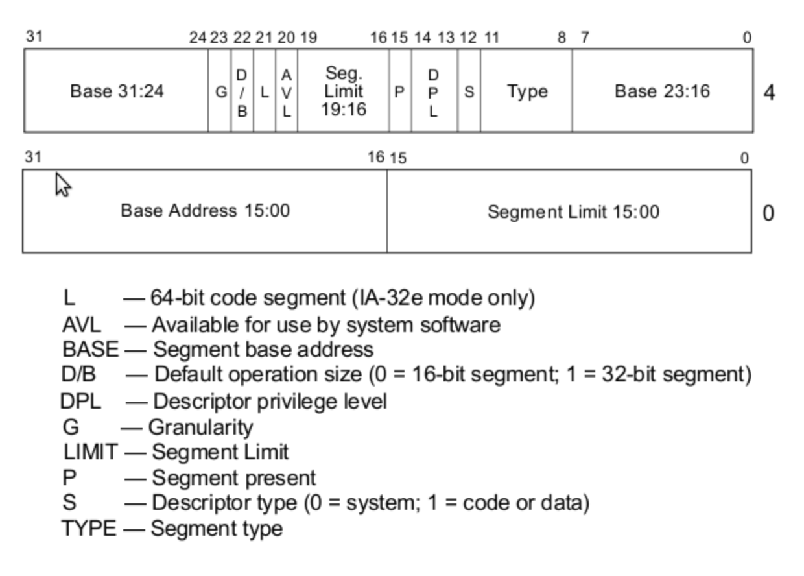

# Segment-based addressing

- Allows programmers to access more memory than a 16-bit offset would allow

- Example: Store value of `ax` to address `0x4fe56` 
- Without segment-based addressing, the best we could do is this (which falls short of intended address):
```asm
mov [0xffff], ax
```
- With segment-based addressing:
```asm
mov bx, 0x4000
mov es, bx
mov [es:0xfe56], ax
```

# Segment descriptor

- The way segmenting memory and using offsets to reach into those segments is implemented differently in 32-bit protected mode (primarily to afford more flexibility).
- In this mode, the process of translating logical addresses (segment register + offset) to physical address is different: Rather than multiply the value of a segment register by 16 then add it to the offset, segment register becomes the index to a particular *segment descriptor* (SD) in the GDT
- Segment descriptor is an 8-byte structure that defines the following properties of a protected-mode segment:
  - Base address (32 bits), which defines where the segment begins in physical memory
  - Segment Limit (20 bits), which defines the size of the segment
  - Various flags, which affect how the CPU interprets the segment, such as the privilige level of code that runs within it or whether it is read- or write-only



- The structure fragments the base address and segment limit throughout the structure
- Example: Lower 16 bits of segment limit are in the first 2 bytes of the structure but the higher 4 bits are at the start of the 17th byte of the structure

- Basic flat model: CPU can't directly load GDT address, it requires a meta structure called "GDT descriptor" with a 16-bit size and a 32-bit address. This is loaded with the 'lgdt' command

- In addition to the code and data segments, the CPU requires that the 1st entry in the GDT purposely be an invalid null descriptor (structure of 8 zero bytes)
- Catches mistakes where we forget to set a particular segment register before accessing an address (easily done if we had segment register set to `0x0` and forgot to update them to the appropriate segment descriptors after switching to protected mode)
- If an addressing attempt is made with the null descriptor, the CPU raises an exception (an interrupt)

# Code segment structure

- Base: 0x0
- Limit: 0xfffff
- Present: 1, since segment is present in memory (used for virtual memory)
- Privilege: 0, ring 0 is the highest privilege
- Descriptor type: 1 for code or data segment, 0 is used for traps
- Type flags:
  - Code: 1 (for code), since this is a code segment
  - Conforming: 0, by not conforming it means code in a segment with lower privilege may not call code in this segment (key to memory protection)
  - Readable: 1 (1 if readable, 0 if execute-only), allow us to read constants defined in the code
  - Accessed: 0, this is often used for debugging and virtual memory techniques (since CPU sets the bit when it accesses the segment)
- Other flags:
  - Granularity: 1, if set, this multiplies our limit by 4K (i.e. 16 * 16 * 16), so our 0xfffff would become 0xfffff000 (i.e. shift 3 hex digits to the left), allowing our segment to span 4Gb of memory
  - 32-bit default: 1, since our segment will hold 32-bit code, otherwise we’d use 0 for 16-bit code. This actually sets the default data unit size for operations (e.g. push 0x4 would expand to a 32-bit number, etc.)
  - 64-bit code segment: 0, unused on 32-bit processor
  - AVL: 0, We can set this for our own uses (e.g. debugging) but we will not use it

# Data segment structure

- Since we are using a simple flat model, with two overlapping code and data segments, the data segment will be identical except for the type flags:
  - Code: 0 for data
  - Expand down: 0, this allows the segment to expand down
  - Writable: 1, this allows the data segment to be written to, otherwise it would be read only
  - Accessed: 0, this is often used for debugging and virtual memory techniques (since the CPU sets the bit when it accesses the segment)

# GDT descriptor

- The GDT is a 6-byte structure containing:
  - GDT size (16 bits)
  - GDT address (32 bits)
